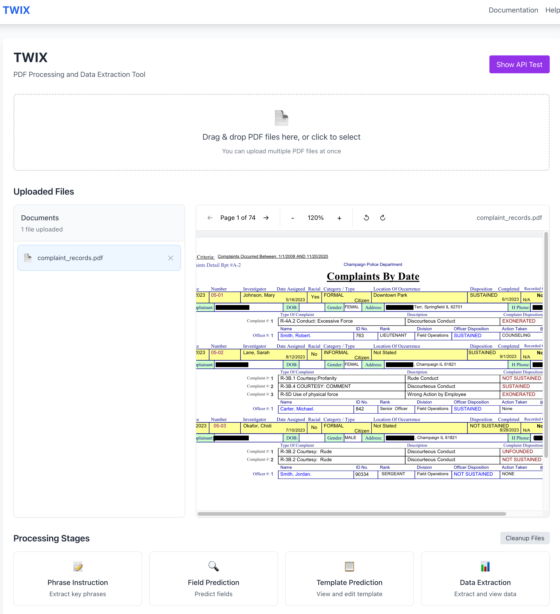

# TWIX: Reconstructing Structured Data from Templatized Documents <!-- omit in toc -->

[](https://arxiv.org/abs/2501.06659)
[](https://data-people-group.github.io/blogs/2025/04/30/twix/)

- [🚀 Getting Started](#-getting-started)
- [📦 Python Package](#-python-package)
- [🖥️ User Interface](#️-user-interface)
- [🤝 Usage Guidance \& Contribution Guidance](#-usage-guidance--contribution-guidance)
  - [Usage Guidance](#usage-guidance)
  - [Contributing to TWIX](#contributing-to-twix)
  - [Contributing Guidance](#contributing-guidance)
- [📚 TWIX API Reference](#-twix-api-reference)


TWIX is a tool for automatically extracting structured data from templatized documents that are programmatically generated by populating fields in a visual template.
TWIX infers the underlying template and then performs data extraction, offering a scalable solution with high accuracy and low cost. In particular, TWIX offers, 

1. A Python package for extracting structured data from documents step by step, designed for production pipeline deployment, with optional user feedback to monitor and refine the extraction process.
2. An interactive UI playground for data extraction that allows users to edit the inferred template, enabling more confident and accurate extraction.


# 🚀 Getting Started

- Python 3.10 or later
- OpenAI API key

1. Clone the repository

```bash
git clone https://github.com/ucbepic/TWIX.git
```

2. Install packages. 

```bash
pip install -e . 
```

3. Set OpenAI API key as environment variable

[You can refer to this document](https://help.openai.com/en/articles/5112595-best-practices-for-api-key-safety)

# 📦 Python Package 

If you want to use TWIX as a Python package, see detailed Python API references in  [TWIX API Reference](#twix-api-reference), and examples below. 

1. To use TWIX to extract structured data step by step, check out [`tests/test_twix.ipynb`](tests/test_twix.ipynb).
2. To use TWIX to extract structured data with a single API call, check out [`tests/test_twix_transform.ipynb`](tests/test_twix_transform.ipynb).
3. To edit the inferred template with user input, check out [`tests/test_twix_user_apis.ipynb`](tests/test_twix_user_apis.ipynb).
4. To see how TWIX performs in large datasets, check out [`tests/test_twix_large.ipynb`](tests/test_twix_large.ipynb). In this example, after inferring the template with a cost of approximately $0.001, TWIX extracts all data from a 1,292-page document in about 4 seconds with zero additional cost. 

# 🖥️ User Interface

If you want to use TWIX in our user interfaces:  

1. Start the frontend server. In the `/twix-ui/` directory, run:

   ```bash
   npm start
   ```

2. Start the backend server in a new terminal. Navigate to the `/twix-ui/backend/`, run: 

   ```bash
   python3 app.py
   ```

In our user interface, you can view the **cumulative cost incurred so far**. You can **edit the template** by updating the fields for each node, as well as **add or delete nodes** before starting data extraction. The outputs generated in this step can be **downloaded as local files**. 

[Watch the TWIX Demo](docs/assets/video/Twix_Demo.mp4)


# 🤝 Usage Guidance & Contribution Guidance

## Usage Guidance 

1. **Applicable Documents**  
TWIX is currently optimized for documents generated from the same template. To infer the underlying template, TWIX requires at least two records (or two pages) created with that template. Sample documents are available in the `tests/data` directory. We are actively working on extending TWIX to support structured data extraction from a single-record (single-page) PDF. Updates will be announced in the repository once this feature is released. 

2. **Phrase Patterns in Documents**  
TWIX uses a free OCR (Optical Character Recognition) tool, PdfPlumber, to extract phrases from documents. TWIX further infers fields and templates based on the extracted phrases. PdfPlumber performs well for extracting individual words; however, in cases where a phrase—such as a table column name or a table cell—spans multiple lines, PdfPlumber fails to recognize the entire phrase and instead returns fragmented words. To address this, TWIX develops a feature powered by vision-based LLMs that first extracts true phrases by using semantic knowledge and vision information from a small document sample, and then learns rules for combining words correctly. These learned rules are applied in downstream phrase extraction. You can enable this feature by setting `vision_feature = True` in `twix.extract_phrase` (it is disabled by default). We are actively working on improving the rule-learning function for phrase extraction. Additionally, we are exploring alternative OCR tools that can better handle multi-line phrase extraction. If you're interested in contributing to the phrase extraction component, feel free to reach out!

## Contributing to TWIX

Several components in TWIX can potentially be replaced and improved by the community.

1. **Using a custom LLM model:**  
   To integrate your own LLM, create a wrapper function for your API that accepts a `prompt` and returns a `response`. The `prompt` should be a tuple of (`instruction`, `context`). For an example implementation, see how we wrap OpenAI's LLM in `twix/models`.  
   Next, add an entry point in `twix/model.py` to expose your LLM interface to TWIX.

2. **Using a custom OCR tool for phrase extraction:**  
   To integrate another OCR tool, ensure that its output is cleaned and formatted as a table. See `tests/out/Investigations_Redacted_modified/Investigations_Redacted_modified_raw_phrases_bounding_box_page_number.txt` for an example. The table should have the following header: `text,x0,y0,x1,y1,page`, where `text` is the extracted phrase, `x0,y0,x1,y1` represent the bounding box coordinates, and `page` indicates the page number.

3. **Using a custom field prediction approach:**  
   To integrate a custom field prediction method, ensure its output is cleaned and formatted as a list of strings, where each string represents an inferred field. See `tests/out/Investigations_Redacted_modified/twix_key.txt` for an example.

We’re excited to chat with you and hear your feedback on new datasets and use cases! Feel free to reach out to `yiminglin@berkeley.edu` to share your thoughts. 

## Contributing Guidance

We welcome contributions! Please follow these guidelines:
1. Fork the repository and create a new feature branch.
2. Follow the coding style used in the codebase.
3. Write tests and update documentation if applicable.
4. Commit with clear messages and open a pull request.
5. Be responsive to code review feedback.

Feel free to reach out by opening an issue or emailing us if you'd like to discuss bigger changes or new features.


# 📚 TWIX API Reference

This document provides an overview of the available APIs in the TWIX Python package. Each API is described with its functionality, parameters, and return values.

---

## API List <!-- omit in toc -->

```python
__all__ = [
    "predict_field",
    "predict_template",
    "extract_data",
    "extract_phrase",
    "transform",
    "remove_template_node",
    "modify_template_node",
    "add_fields",
    "remove_fields"
]
```

Below is a detailed description of each API:

---

### 1. extract_phrase<!-- omit in toc -->

Extracts phrases from PDFs by using OCR tools.

- **Parameters:**
  - `data_files` (list): Stores a list of paths to documents that are created using the same template.
  - `result_folder` (str): The path to store results. 
  - `LLM_model_name` (str, optional): Specify the LLM model name.  
  - `page_to_infer_fields` (int, optional): TWIX extracts all phrases from each input document by default. For field prediction, it separately creates a small document sample by specifying `page_to_infer_fields` (by default is 5), which determines how many pages are used for inferring fields. 
  - `vision_feature` (boolean, optional): If set to True, TWIX uses a vision-based LLM to extract phrases from the first two pages of the document and learn rules to merge words into phrases. Defaults to False.
- **Returns:**
  - `dict`: A dict of phrases per input document. The key in the dict stores the document name. The value corresponds to the raw extracted phrases and their bounding box, which are also written in the result folder.
  - `cost` (float): The cost incurred during the function call. 

---

### 2. predict_field<!-- omit in toc -->

Predicts a list of fields from documents. Fields refer to phrases in table headers or keywords in key-value pairs.

- **Parameters:**
  - `data_files` (list): Stores a list of paths to documents that are created using the same template.
  - `result_folder` (str): The path to store results. 
  - `LLM_model_name` (str, optional): Specify the LLM model name. 
- **Returns:**
  - `list`: A list of predicted fields. TWIX also writes the results in the local result folder, naming the file as `twix_key.txt`.
  - `cost` (float): The cost incurred during the function call. 
---

### 3. predict_template<!-- omit in toc -->

Predicts the template from documents. A template is defined as a tree (refer to the paper for details) and stored as a JSON. Each tree node (JSON object) corresponds to the abstract of a data block, storing the type and fields of the node.

- **Parameters:**
  - `data_files` (list): Stores a list of paths to documents that are created using the same template.
  - `result_folder` (str): The path to store results. 
  - `LLM_model_name` (str, optional): Specify the LLM model name. 
- **Returns:**
  - `list`: The template as a list of nodes, stored locally in the result folder, naming the file as `template.json`.
  - `cost` (float): The cost incurred during the function call. 
---

### 4. extract_data<!-- omit in toc -->

Extracts data based on a template.

- **Parameters:**
  - `data_files` (list): Stores a list of paths to documents that are created using the same template.
  - `template` (list, optional): The template output from `predict_template`. If not specified, TWIX will look in the local result folder to read the predicted template.
  - `result_folder` (str): The path to store results. 
- **Returns:**
  - `dict`: A dictionary of extraction results, where the key is the file name, and the value is the extraction object of that file. Each extraction object is a list of data blocks containing either table blocks or key-value blocks. Results will be written locally in the result folder, naming the file as `extracted.json`.
  - `cost` (float): The cost incurred during the function call. 
---

### 5. transform<!-- omit in toc -->

Provides an end-to-end API to directly extract data from PDFs.

- **Parameters:**
  - `data_files` (list): Stores a list of paths to documents that are created using the same template.
  - `result_folder` (str): The path to store results. 
  - `LLM_model_name` (str): Specify the LLM model name. 
  - `vision_feature` (boolean, optional): If set to True, TWIX uses a vision-based LLM to extract phrases from the first two pages of the document and learn rules to merge words into phrases. Defaults to False.
- **Returns:**
  - `fields` (list): A list of strings representing the predicted fields.
  - `template` (list): The template as a list of nodes, stored locally in the result folder, naming the file as `template.json`.
  - `extraction_object` (dict): A dictionary of extraction results, where the key is the file path, and the value is the extraction object of that file. Each extraction object is a list of data blocks containing either table blocks or key-value blocks. Results will be written locally in the result folder, naming the file as `extracted.json`.
  - `cost` (float): The cost incurred during the function call. 
---

### 6. add_fields<!-- omit in toc -->

Allows users to add fields to the predicted fields.

- **Parameters:**
  - `added_fields` (list): A list of fields to add based on the predicted fields.
  - `result_folder` (str): The path to store results. 

---

### 7. remove_fields<!-- omit in toc -->

Allows users to delete fields from the predicted fields.

- **Parameters:**
  - `removed_fields` (list): A list of fields to delete based on the predicted fields.
  - `result_folder` (str): The path to store results. 

---

### 8. remove_template_node<!-- omit in toc -->

Allows users to remove nodes in the predicted template.

- **Parameters:**
  - `node_ids` (list): A list of node IDs. Each node ID is an integer.
  - `result_folder` (str): The path to store results. 

---

### 9. modify_template_node<!-- omit in toc -->

Allows users to update nodes in the predicted template.

- **Parameters:**
  - `node_id` (int): The integer node ID to update.
  - `type` (str): The type of the node to update, either `"kv"` or `"table"`.
  - `fields` (list): A list of fields (strings) to update.
  - `result_folder` (str): The path to store results. 


