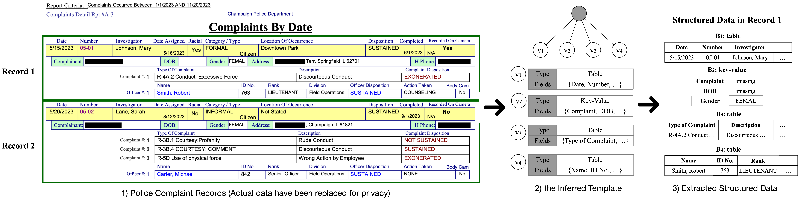
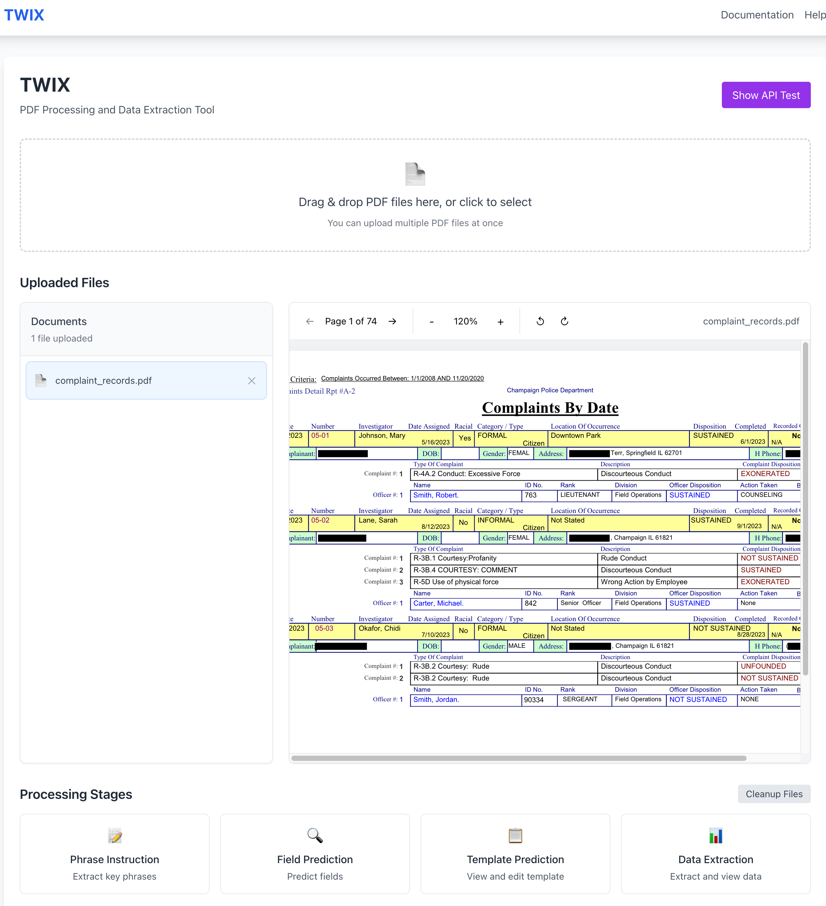

# TWIX: Reconstructing Structured Data from Templatized Documents

[](https://arxiv.org/abs/2501.06659)
[](https://data-people-group.github.io/blogs/2025/04/30/twix/)

TWIX is a research system for extracting structured data from PDFs generated
from a shared visual template. It learns fields and a hierarchical template
from a small sample, then applies the learned structure to extract key-value and
table blocks from documents in the same template family.

The repository provides:

- a staged Python API for phrase extraction, field prediction, template
  inference, and data extraction;
- an end-to-end `transform` API;
- helpers for reviewing and editing inferred fields and template nodes; and
- a React/Flask playground for uploading PDFs, inspecting intermediate results,
  editing the inferred template, and downloading extracted data.



> [!IMPORTANT]
> TWIX is a research prototype, not a general-purpose OCR system. It works best
> on PDFs with selectable text and repeated layouts. Model calls incur OpenAI
> API usage, and template/data extraction requires Gurobi.

## How TWIX works

The public pipeline has four stages:

```text
PDFs from one template family
  -> extract_phrase    # text, geometry, and optional phrase-grouping assistance
  -> predict_field     # candidate table headers and key-value labels
  -> predict_template  # hierarchical kv/table template plus document metadata
  -> extract_data      # record/block separation and structured JSON output
```

`twix.transform(...)` runs the same stages end to end. The inferred artifacts
are written to disk so they can be inspected, edited, and reused.

Current model dispatch supports `gpt-4o-mini` and `gpt-4o`. Field and template
inference use OpenAI text/vision calls. Phrase extraction itself is based on
`pdfplumber`; enabling `vision_feature` uses a vision model to learn better
phrase-merging rules from a rendered sample page.

## Requirements

- Python 3.10 or newer recommended
- an `OPENAI_API_KEY`
- [Poppler](https://poppler.freedesktop.org/) for PDF page rendering through
  `pdf2image`
- [Gurobi](https://www.gurobi.com/) and a valid license for optimization
- Node.js and npm only if you want to run the UI
- Tesseract only if you use the optional helper image-OCR path

On macOS, the external PDF dependency can be installed with:

```bash
brew install poppler
```

Install and license Gurobi using its platform-specific instructions.

## Installation

```bash
git clone https://github.com/ucbepic/TWIX.git
cd TWIX

python -m venv .venv
source .venv/bin/activate
python -m pip install --upgrade pip
python -m pip install -e .

export OPENAI_API_KEY="your-api-key"
```

Keep API keys in your environment or an untracked local configuration; never
commit them. See OpenAI's [API key safety guidance](https://help.openai.com/en/articles/5112595-best-practices-for-api-key-safety).

## Quick start

Use one or more PDFs that belong to the same template family. Single-PDF and
single-page inputs are supported; repeated layouts generally provide more
evidence for structural inference.

```python
from pathlib import Path
import os
import twix

pdf_paths = ["tests/data/Investigations_Redacted_modified.pdf"]

# Keep the trailing separator: the current implementation concatenates several
# artifact filenames directly onto result_folder.
result_folder = str(Path("tests/out/my_run")) + os.sep

fields, template, extracted, cost = twix.transform(
    pdf_paths,
    result_folder,
    "gpt-4o-mini",
)
```

The `cost` values are built-in estimates, not billing records. In the current
implementation, `transform` returns the final stage's cost rather than the
accumulated total; call the staged APIs if you need per-stage values.

### Run the stages separately

The staged API makes it possible to inspect or edit intermediate artifacts:

```python
phrases, phrase_cost = twix.extract_phrase(
    pdf_paths,
    result_folder,
    LLM_model_name="gpt-4o-mini",
    page_to_infer_fields=5,
    vision_feature=False,
)

fields, field_cost = twix.predict_field(
    pdf_paths,
    result_folder,
    LLM_model_name="gpt-4o-mini",
)

template, template_cost = twix.predict_template(
    pdf_paths,
    result_folder,
    LLM_model_name="gpt-4o-mini",
)

extracted, extraction_cost = twix.extract_data(
    pdf_paths,
    result_folder,
    template=template,
)
```

Examples are available in:

- [`tests/test_twix.ipynb`](tests/test_twix.ipynb): staged pipeline
- [`tests/test_twix_transform.ipynb`](tests/test_twix_transform.ipynb): end-to-end API
- [`tests/test_twix_user_apis.ipynb`](tests/test_twix_user_apis.ipynb): editing fields and templates
- [`tests/test_twix_large.ipynb`](tests/test_twix_large.ipynb): larger-document example

These notebooks are integration examples and can make paid API calls.

## Output artifacts

For an input named `document.pdf`, the result folder normally contains:

```text
<result_folder>/
├── merged.pdf
├── merged_phrases.txt
├── merged_phrases_bounding_box_page_number.json
├── merged_raw_phrases_bounding_box_page_number.txt
├── document_phrases.txt
├── document_bounding_box_page_number.json
├── document_raw_phrases_bounding_box_page_number.txt
├── twix_key.txt
├── metadata.txt
├── metadata_rows.txt
├── template.json
├── document_extracted.json
└── _image/0.jpg
```

The `*_raw_phrases_bounding_box_page_number.txt` files contain CSV data with
the columns `text,x0,y0,x1,y1,page` despite their `.txt` suffix.

## Public API

| Function | Purpose | Return value |
| --- | --- | --- |
| `extract_phrase(data_files, result_folder, LLM_model_name="gpt-4o-mini", page_to_infer_fields=5, vision_feature=False)` | Extract phrases and coordinates for inference and for every input document | `(phrases_by_document, estimated_cost)` |
| `predict_field(data_files, result_folder, LLM_model_name="gpt-4o-mini")` | Infer table headers and key-value labels | `(fields, estimated_cost)` |
| `predict_template(data_files, result_folder, LLM_model_name="gpt-4o-mini")` | Infer `kv` and `table` nodes plus document metadata | `(template, estimated_cost)` |
| `extract_data(data_files, result_folder, template=[])` | Extract structured records using a supplied or saved template | `(extractions_by_document, estimated_cost)` |
| `transform(pdf_paths, result_folder_path, LLM_model_name, vision_feature=False)` | Run all stages | `(fields, template, extractions, estimated_cost)` |

The package also exports artifact-editing helpers:

```python
twix.add_fields(added_fields, result_folder)
twix.remove_fields(removed_fields, result_folder)
twix.remove_template_node(node_ids, result_folder)
twix.modify_template_node(node_id, type, fields, result_folder)
```

Template nodes use `type` (`"kv"` or `"table"`), `fields`, `bid`, `child`, and
`node_id`. The checked-in `tests/out/*/template.json` files show concrete
examples. Treat `modify_template_node` cautiously in the current version: its
non-target-node branch is known to need correction.

## User interface

The UI consists of a Flask API on port 3001 and a Create React App frontend on
port 3000. Start them in separate terminals from the repository root.

Terminal 1:

```bash
source .venv/bin/activate
python twix-ui/backend/app.py
```

Terminal 2:

```bash
cd twix-ui
npm install
npm start
```

Open [http://localhost:3000](http://localhost:3000). The frontend is configured
to call `http://127.0.0.1:3001`.

The playground exposes cumulative cost estimates, intermediate phrase and
bounding-box data, editable fields/template nodes, and downloadable extraction
results.

[Watch the TWIX demo](docs/assets/video/Twix_Demo.mp4)



## Scope and limitations

- Inputs should come from one template family. Mixing unrelated layouts in one
  run is outside the intended use case.
- The main extractor expects selectable PDF text. Scanned/image-only PDFs need
  a separate OCR step; `vision_feature=True` is phrase-grouping assistance, not
  full-document OCR.
- Structural inference is stronger when the sample contains repeated records or
  pages, even though single inputs are supported.
- The extraction implementation imports Gurobi and needs a usable license.
- Cost accounting is approximate and based on static prices in `twix/cost.py`.
- Result-directory paths currently rely on a trailing path separator.
- The project currently uses Jupyter integration notebooks rather than a
  comprehensive offline Python test suite.

## Development and verification

Read [`AGENTS.md`](AGENTS.md) before making code changes. Useful checks that do
not call external models are:

```bash
python -m compileall -q twix twix-ui/backend/app.py
python -c "import twix; print(twix.__all__)"

cd twix-ui
npm test -- --watchAll=false
npm run build
```

Do not execute the pipeline notebooks as a routine test unless you intend to
make OpenAI API calls.

## Contributing

1. Fork the repository and create a feature branch.
2. Keep changes focused and preserve checked-in sample artifacts.
3. Add or update tests and documentation for behavior changes.
4. Run the relevant offline checks.
5. Open a pull request against `ucbepic/TWIX` and respond to review feedback.

For larger changes, open an issue first or contact `yiminglin@berkeley.edu`.

## Citation

If TWIX supports your work, please cite the [TWIX paper](https://arxiv.org/abs/2501.06659).
